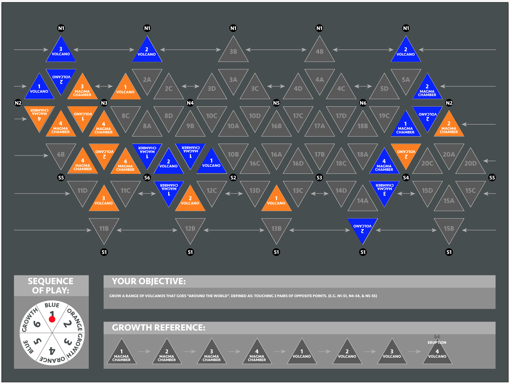

# Volcanoes
This is a prototype for a new board game concept. 

## Rules
The goal of the game is to create an unbroken line of volcanoes which connect points on 
opposite sides of the [Pentakis Icosidodecahedron](https://en.wikipedia.org/wiki/Pentakis_icosidodecahedron) board.

### On your turn you may:
1. Place a level 1 Magma Chamber on an empty space.
2. Progress one of your pieces one step forward on the growth track.

### When a volcano progresses to level 4 (on a person's turn or via a growth phase), the volcano erupts with the following effects:
1. The level 4 volcano becomes a level 1 magma chamber.
2. The three triangle spaces adjacent are affected in the following ways:
    A. Empty spaces become level 1 magma chambers.
    B. Spaces with your pieces (magma chambers or volcanos) progress one level on the growth track.
    C. Spaces with your opponent's pieces regress one level on the growth track (level 1 magma chambers become empty spaces).