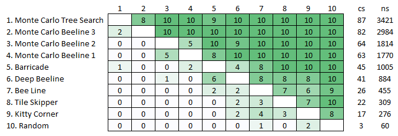

# Volcanoes
This is a prototype for a new board game concept being designed by Simon Dorfman.

## Rules
The goal of the game is to create an unbroken line of volcanoes which connect points on 
opposite sides of the [Pentakis Icosidodecahedron](https://en.wikipedia.org/wiki/Pentakis_icosidodecahedron) board.

### On your turn you may
1. Place a level 1 magma chamber on an empty tile
2. Progress one of your tiles one level on the growth track
   * Level 5 magma chambers become level 1 volcanoes
   * Level 4 volcanoes erupt with the following effects
      * The level 4 volcano turns back into a level 1 volcano
      * The tiles adjacent to the erupting volcano are affected in the following ways
         * Empty tiles become level 1 magma chambers
         * Owned tiles progress one level on the growth track
         * Enemy tiles regress one level on the growth track

### Progression of play
1. Player one's turn
2. Player two's turn
3. Growth (every non-empty tile on the board is advanced one level on the growth track)
4. Player two's turn
5. Player one's turn
6. Growth

This cycle repeats until a player wins by successfully connecting a pair of antipodes (tiles directly opposite each other). 

## Engines
Several computer AIs are included with Volcanoes. Here are the current rankings.

Our goal is to learn strategies for this game through the analysis of games played by computer AIs.