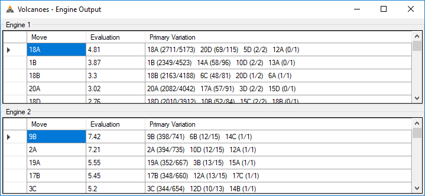

# Volcanoes
This is a prototype for a new board game concept being designed by Simon Dorfman and developed by Scott Clayton.

## Rules
The goal of the game is to create an unbroken line of volcanoes which connect points on 
opposite sides of the [Pentakis Icosidodecahedron](https://en.wikipedia.org/wiki/Pentakis_icosidodecahedron) board.

### On your turn you may
1. Place a level 1 magma chamber on an empty tile
2. Progress one of your tiles one level on the growth track
   * Level 5 magma chambers become level 1 volcanoes
   * Level 4 volcanoes erupt with the following effects
      * The level 4 volcano turns back into a level 1 volcano
      * The tiles adjacent to the erupting volcano are affected in the following ways
         * Empty tiles become level 1 magma chambers
         * Owned tiles progress one level on the growth track
         * Enemy tiles regress one level on the growth track

### Progression of play
1. Player one's turn
2. Player two's turn
3. Growth (every non-empty tile on the board is advanced one level on the growth track)
4. Player two's turn
5. Player one's turn
6. Growth

This cycle repeats until a player wins by successfully connecting a pair of antipodes (tiles directly opposite each other). 

## Engines
Several computer AIs are included with Volcanoes. Here are the current rankings from a recent round robin tournament.

Our goal is to learn strategies for this game through the analysis of games played by computer AIs.

## Features
Most engines report their progress while searching for the best move.

The board can be rotated around different axes to make it easier to see paths which wrap around the cyclical board.

Run round robin tournaments with the provided engines to get cross tables and detailed result data.

Player One | Player Two | Winner | Termination | Total Moves | Total Milliseconds | Starting Tile Index | Transcript
--- | --- | --- | --- | --- | --- | --- | ---
Barricade | Monte Carlo Tree Search | Two | Normal | 54 | 130188 | 64 | 17A 18D G 10C 10A G 5D 20D G 8B 8A G 13D 4C G 2B 2A G 3B 3A G 11C 3C G 15D 20B G 18C 18B G 19A 18D G 2C 19B G 19D 14C G 20D 20C G 12A 7D G 7A 10B G 7C 3D G 7A 4B G
Monte Carlo Tree Search | Barricade | One | Normal | 51 | 108007 | 70 | 18C 13B G 18A 6B G 9B 9A G 14D 16D G 9D 13C G 14B 1A G 3B 3A G 17A 20A G 12A 12C G 4D 3D G 5B 16C G 8A 17D G 1B 8B G 10A 7A G 1C 19B G 15D 16B G 4B 11B G

