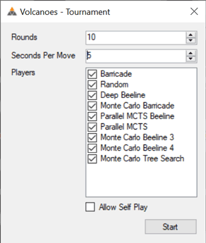

# Volcanoes
This is a prototype for a new board game concept being designed by Simon Dorfman and developed by Scott Clayton.

## Rules
The goal of the game is to create a line of adjacent volcanoes which connect tiles on 
opposite sides of the [Pentakis Icosidodecahedron](https://en.wikipedia.org/wiki/Pentakis_icosidodecahedron) board (an 80-tile sphere-ish shape).

### On your turn you may
1. Place a level 1 volcano of your color on an empty tile
2. Progress one of your tiles one level on the growth track
   * Level 4 volcanoes erupt with the following effects
      * The level 4 volcano becomes dormant (it no longer grows)
      * The tiles adjacent to the erupting volcano are affected in the following ways
         * Friendly volcanoes progress one level on the growth track
         * Enemy volcanoes are destroyed and become empty tiles

### Progression of play
1. Player one's turn (Blue always goes first)
2. Player two's turn (Orange always goes second)
3. Growth (every non-empty tile on the board is advanced one level on the growth track)
4. Player two's turn (Orange's turn)
5. Player one's turn (Blue's turn)
6. Growth

This cycle repeats until a player wins by successfully connecting a pair of antipodes (tiles directly opposite each other). 

## Engines
Several computer AIs are included with Volcanoes. Here are the current rankings from a recent round robin tournament:

Our goal is to learn strategies for this game through the analysis of games played by computer AIs.

More information about the last two columns:

* CS = Cumulative Score (number of wins)
* NS = [Neustadtl Score](https://en.wikipedia.org/wiki/Sonneborn%E2%80%93Berger_score) (tie break score; basically a score weighted by strength of opposition where a win against a stronger opponent is worth more)

## Features
Most engines report their progress while searching for the best move.

The board can be rotated around different axes to make it easier to see paths which wrap around the cyclical board.

Run round robin tournaments with the provided engines to get cross tables and detailed result data.

| Player One              | Player Two    | Winner | Termination | Total Moves | Total Milliseconds | Starting Tile Index | Transcript                                                                                                                            | Winning Path                                    |
| ----------------------- | ------------- | ------ | ----------- | ----------- | ------------------ | ------------------- | ------------------------------------------------------------------------------------------------------------------------------------- | ----------------------------------------------- |
| Monte Carlo Tree Search | Parallel MCTS | Two    | Normal      | 39          | 152276             | 1                   | N01 N19 G N03 N04 G S24 N15 G S17 N17 G S15 N04 G N23 S04 G S34 S01 G S13 S03 G S10 S13+ G S03 S02 G S02+ S03+ G N19 N05 G S04 N19+ G | N13 N03 N04 N05 N19 N20 N39 N38 S28 S29 S12 S13 |
| Monte Carlo Tree Search | Parallel MCTS | One    | Normal      | 19          | 109903             | 46                  | S39 N24 G S03 S10 G N11 S08 G N04 S01 G N19 S02 G N01 N07 G S02                                                                       | N10 N11 N27 N28 S38 S39 S20 S19 S05 S01 S02 S10 |
| Monte Carlo Tree Search | Parallel MCTS | Two    | Normal      | 28          | 87456              | 7                   | N09 N07 G N11 N10 G N21 N11+ G N39 N02 G N14 N13 G N01+ N04 G N02 N05+ G N04 N16 G N16+ N03+ G N04                                    | N38 N37 N18 N19 N05 N04 N03 N13 N12 N29 N28 S38 |
